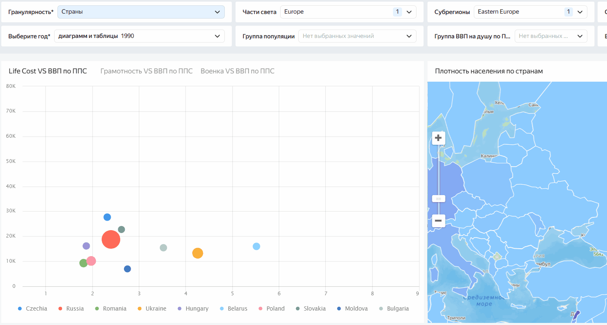
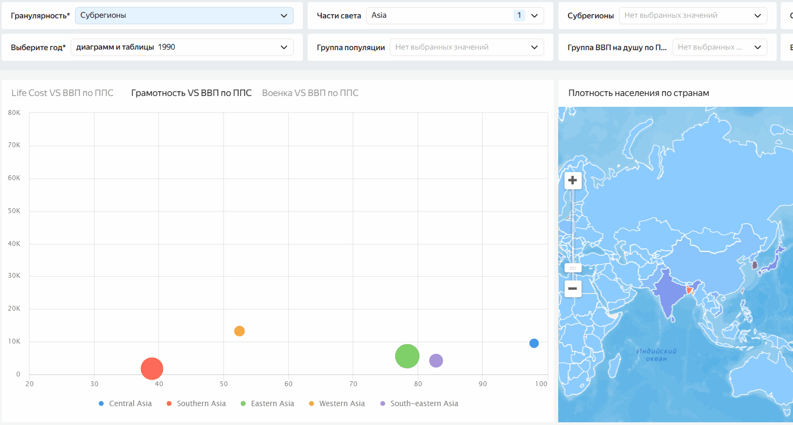
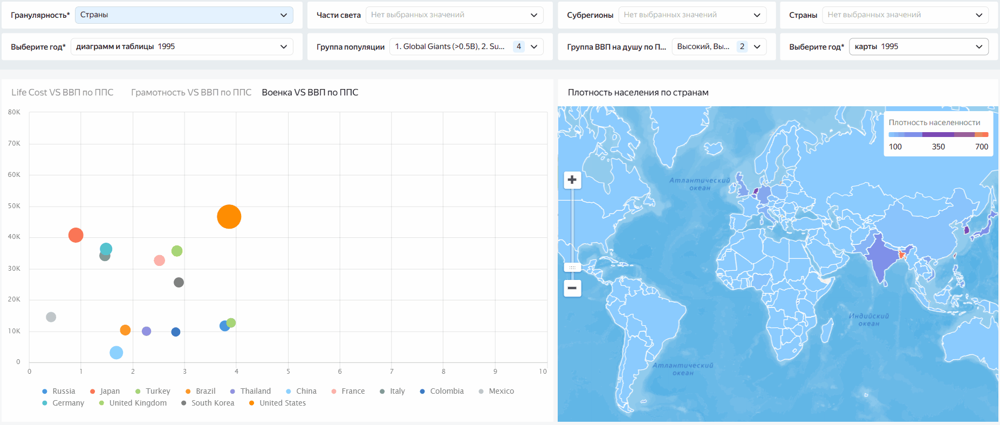
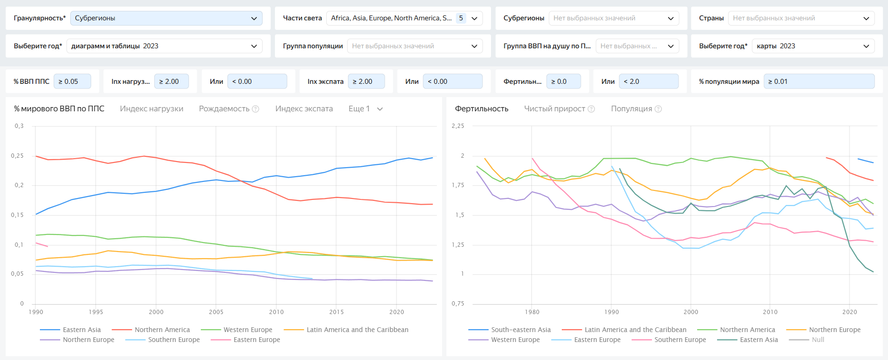
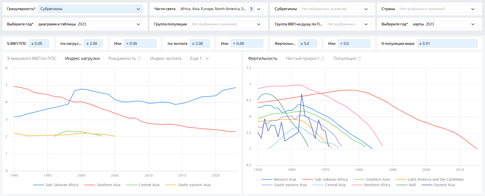
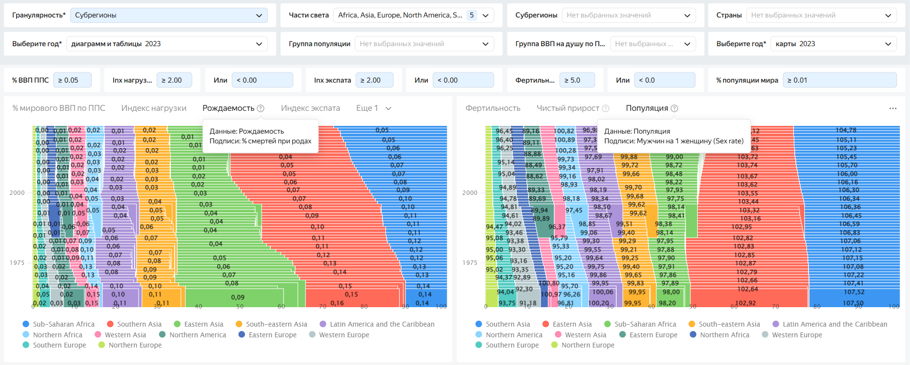
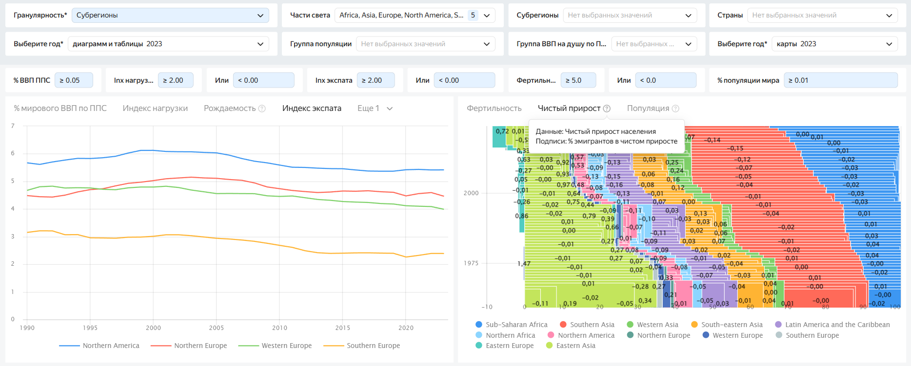
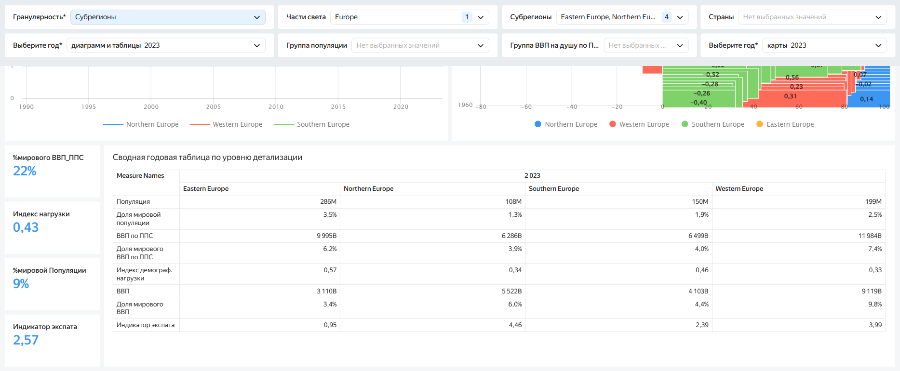

# Global Demographic and Economic Analysis (1950–2023)

## Цели проекта
Создание дашборда, насыщенного ценными инсайдами по мировой демографии и экономики

## Основные используемые технологии:
Python (Pandas, NumPy, Geopandas), DataLens, SQL

## Структура Jupyter Notebook
* Выгрузка, преобразование и объединение 13 датасетов с OWID
* Заполнение пропусков и очистка данных
* Расчет новых столбцов метрик и групп
* Обработка и проверка столбцов
* Преобразовываем shp-файла с геополигонами в GeoJSON для дальнешего преобразования на nextgis в csv

## Структура Datalens
**Два датасета:**
Основной из prepared_data - обработанные нами данные в jupyter lab
Cоединенные prepared_data с datalens_geopolygons для построения карты плотности населения

**Фильтры:**
  - "Гранулярность" - базовый и обязательный фильтр дашборда, который определяет уровень детализации на графиках и таблицах: Части света, Субрегионы, Страны, Группы по популяции, Группы по ВВП на душу по ППС
  - "Части света", "Субрегионы", "Страны" - географические фильтры
    Данные по этим группам взяты с Github Datahub - https://github.com/datasets
  - "Группы популяции" - фильтр по население страны, задал пороговые значения на 6 групп
  - "Группы по ВВП на душу по ППС" - фильтр по ВВП на душу по ППС страны за 2023 год, использовал команду pandas qcut, для разбивки на 4 корзины (46x4 и 144 без данных)
  - "Выберите год (для диаграмм)" и "Выберите год (для карты)" - обязательные фильтры для пузырьковых диаграмм и карты, годы с 1990 по 2023 и с 1950 по 2023 соответственно.
  - 
**Чарты:**
  - **Пузырьковые диаграммы**
    1. "Life Cost VS ВВП по ППС"
    
    2. "Грамотность VS ВВП по ППС"
    
    3. "Военка VS ВВП по ППС"
  - **Карта заселенности**

     4. "Плотность населения по странам" - карта стран с отрисовкой цвета полигона в зависимости от плотности населения страны с 1950 по 2023 годы
    
  - **Линейные графики и нормализованные диаграммы (на каждом скрине по 2 чарта)**

    5. "Доля в мировой экономике" и "Фертильность"
    

    6. "Уровень демографической нагрузки" и "Фертильность"
    

    7. "Рождаемость с долей смертности при родах" и "Популяция с долей мужчин на женщину"
    

    8. "Индекс путешественника" и "Чистый прирост населения с долей миграции"
    
  - **Сводная годовая таблица по уровню детализации**
    
    
**Средневзвешенное считаем по Популяции и учитываем возможные NULL, точечно исключая их проверкой в начале формулы**.
Что позволило избежать 'статистического шума' от малых стран и получить корректную картину по регионам и миру в целом.

**Методики расчета индексов:**
* Индекс демографической нагрузки = Доля от мировой популяции / Доля от мирового ВВП по ППС
* Индекс экспата = Доля от мирового ВВП / Доля от мировой популяции

**Ссылка на дашборд**:
https://datalens.yandex/ssfqv0ouzxhsc
